# Emoji Predictor

deploy [premoji](https://github.com/nickyfoto/premoji/) on heroku.

## Datasets

[kaggle](https://www.kaggle.com/hariharasudhanas/twitter-emoji-prediction) tweets dataset [twitter-emoji-prediction](https://github.gatech.edu/qhuang80/emoji/tree/master/twitter-emoji-prediction) from.

[Twemoji](https://uvaauas.figshare.com/articles/Twemoji_Dataset/5822100) dataset from University of Amsterdam.

## preprocess

- drop duplicates

## GitHub repos & APIs

- [DeepMoji](https://github.com/bfelbo/DeepMoji)
- [Emoji for Python](https://pypi.org/project/emoji/)
- [tweet-preprocessor](https://pypi.org/project/tweet-preprocessor/) Preprocessor is a preprocessing library for tweet data written in Python
- [Twitter-Occupation-Prediction](https://github.com/jqnap/Twitter-Occupation-Prediction) Code and data accompanying paper "Twitter Homophily: Network Based Prediction of User’s Occupation" to be appearing at ACL 2019.
- [Natural Language Toolkit](https://www.nltk.org/)
- [Twitter API](https://developer.twitter.com/en/docs/tweets/post-and-engage/api-reference/get-statuses-show-id)

## Miscellaneous

- [Use Predictive emoji on iOS](https://support.apple.com/en-us/HT202332)
- [Project page example](https://github.gatech.edu/pages/jahuja6/InverseAirfoilDesign/)
- [sklearn model persistence](https://scikit-learn.org/stable/modules/model_persistence.html)

## Glossary

- [Extracting features from text files](https://scikit-learn.org/stable/modules/feature_extraction.html#text-feature-extraction)
	- [Bags of words](https://scikit-learn.org/stable/tutorial/text_analytics/working_with_text_data.html#bags-of-words)
	- [tf-idf](https://scikit-learn.org/stable/tutorial/text_analytics/working_with_text_data.html#from-occurrences-to-frequencies)

## Images

Emoji distribution (kaggle dataset)

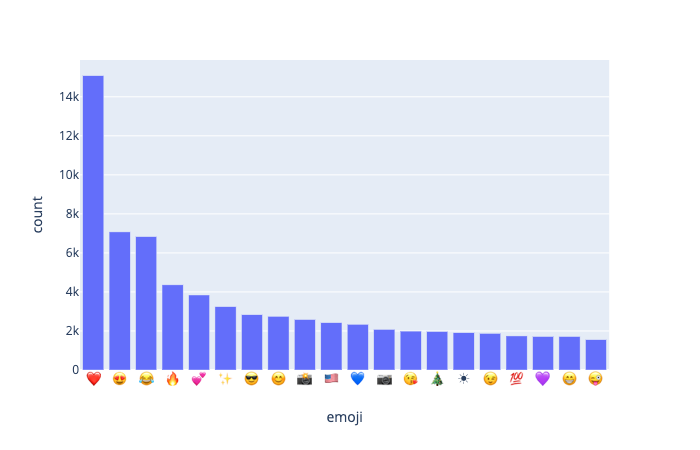

Tweet length

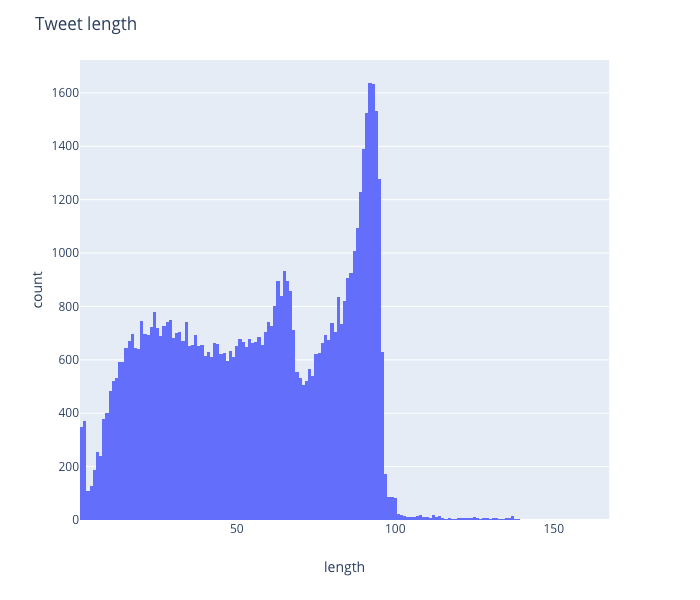

Word count per tweet

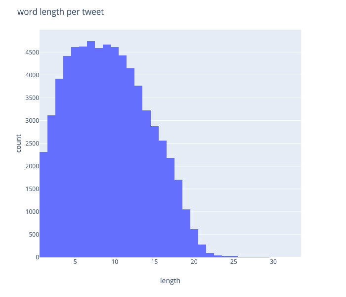

Dataset word count without stoping words

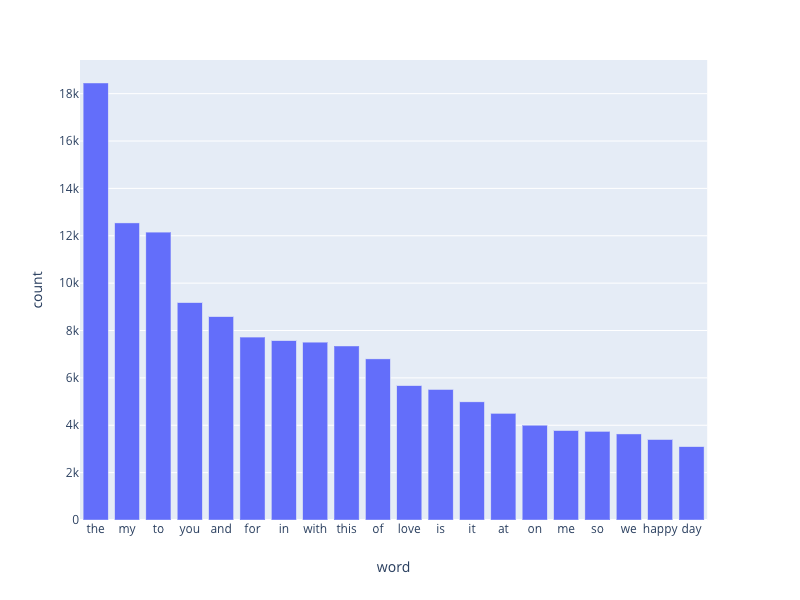

Dataset word count using stoping words

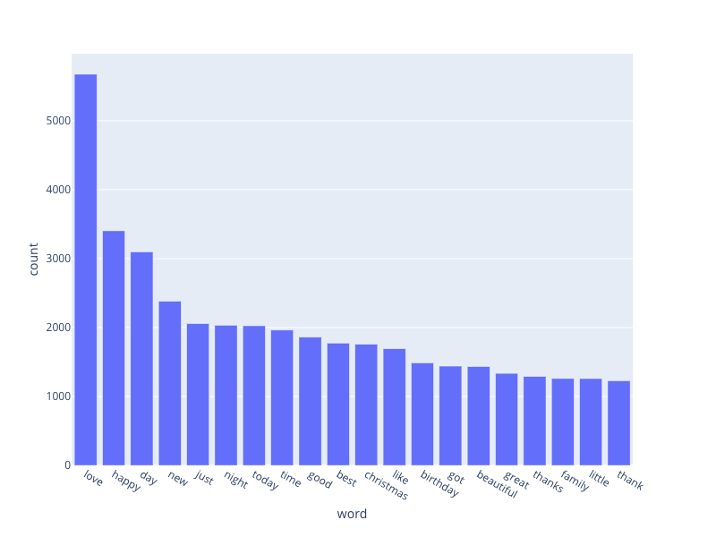

Word cloud
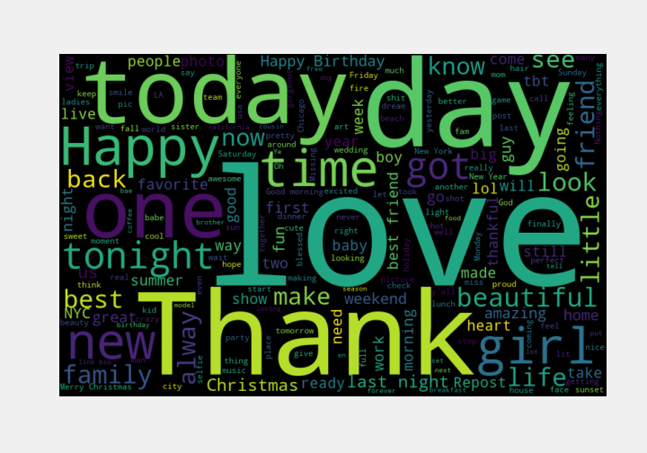

Top 20 chi score words (5 emoji) 
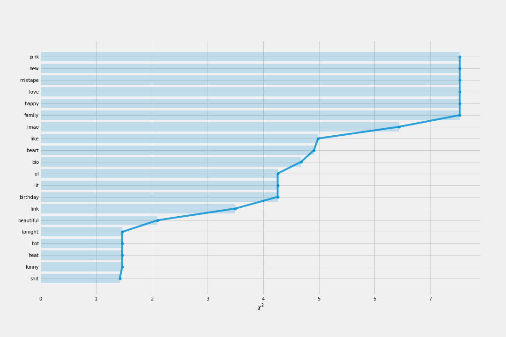


Top 20 hashtags


Top 5 hashtags for top 5 emoji

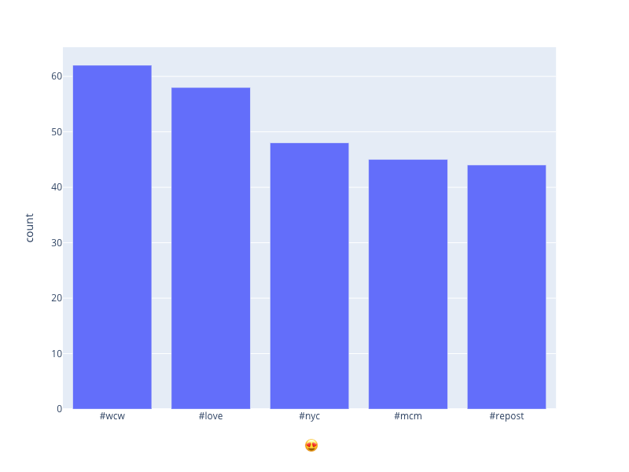
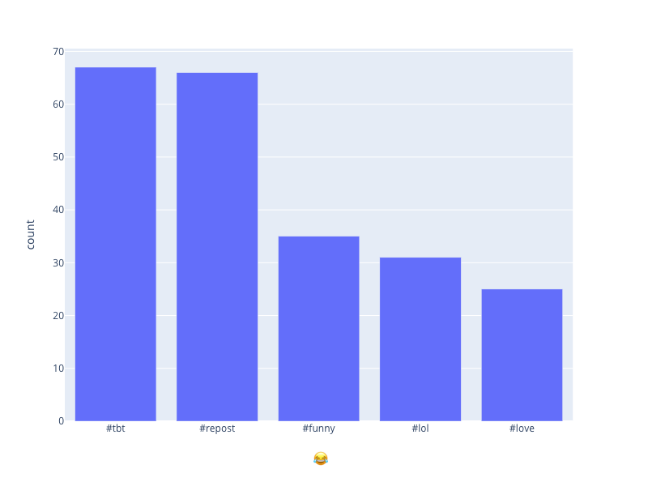
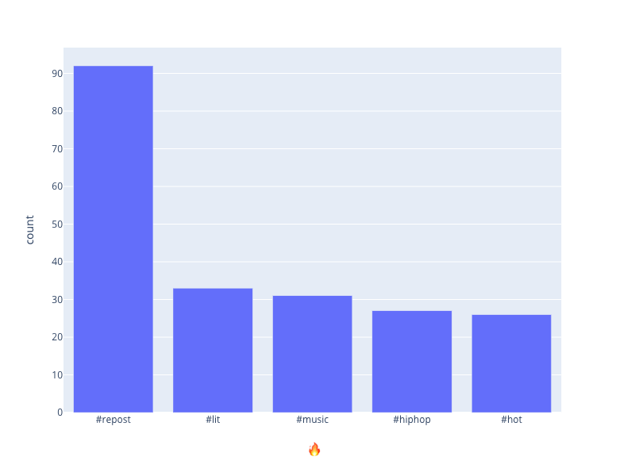
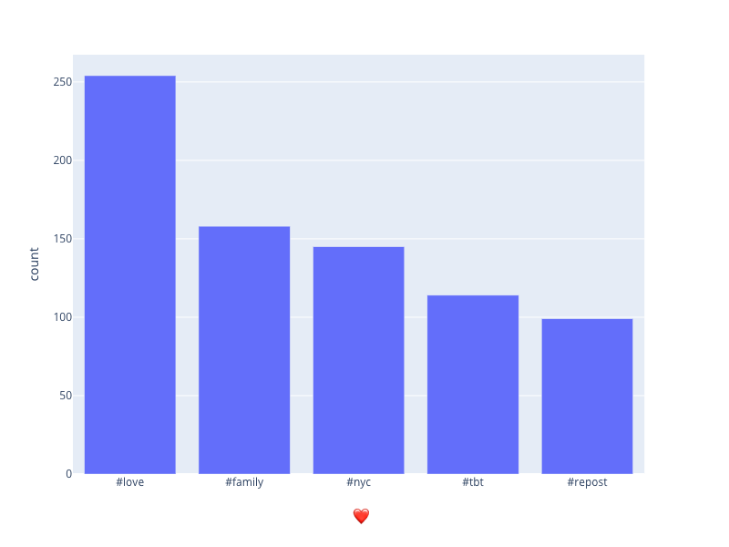
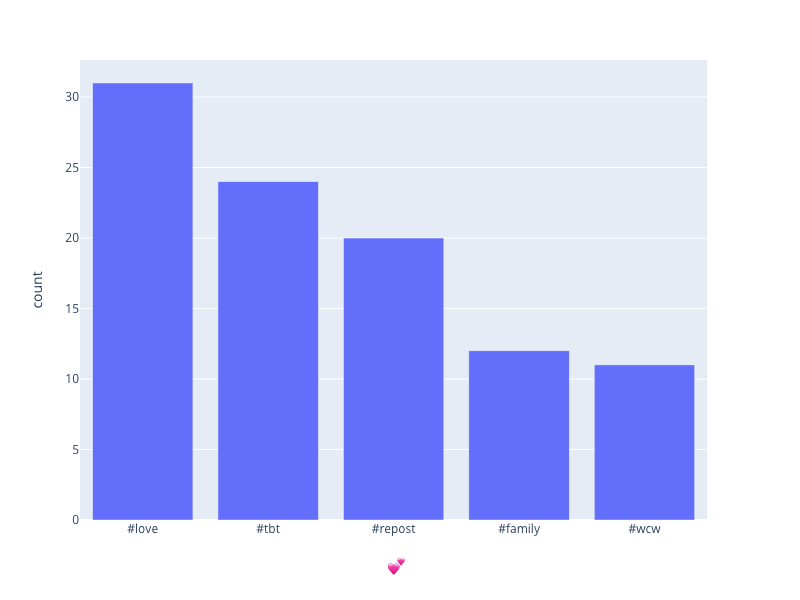

Train test split

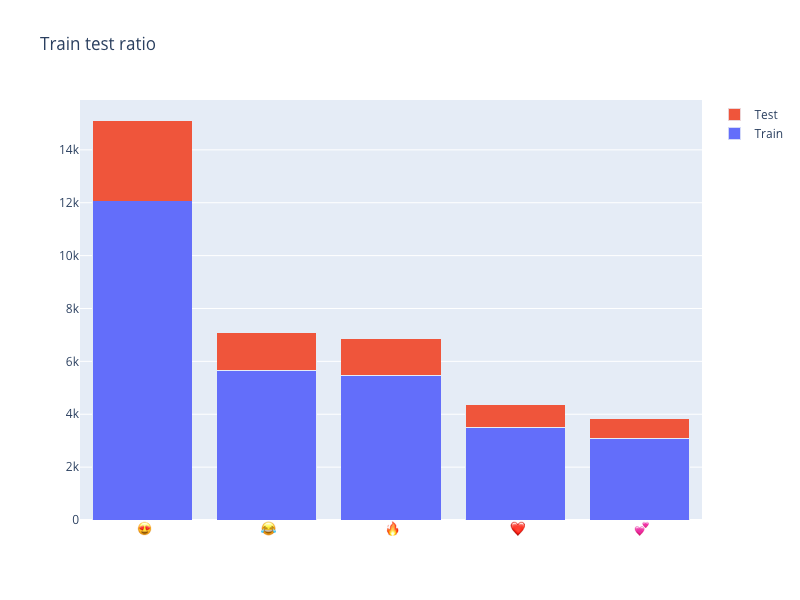


Top 5 emoji confusion matrix

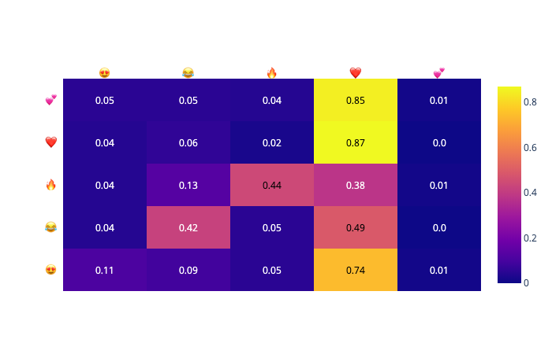

result top 5
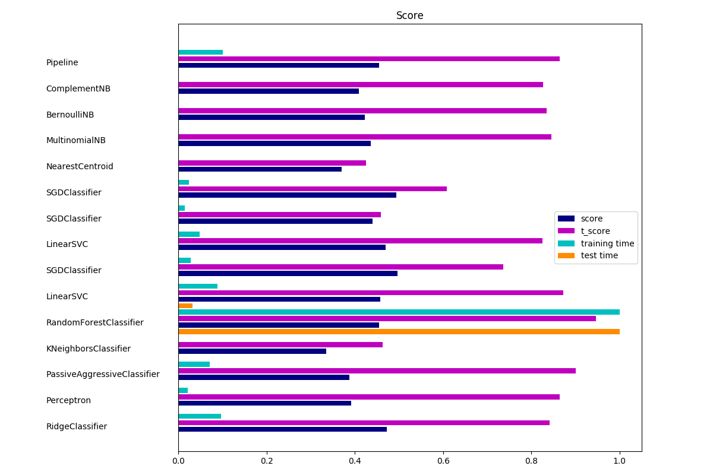

result top 20
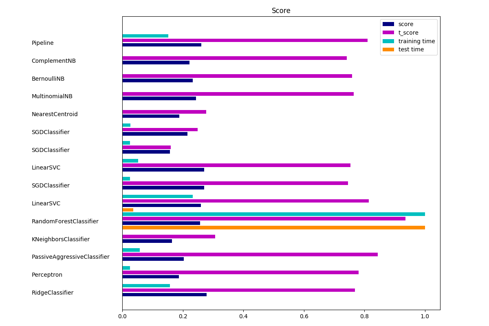

## Development

### run flask app locally

```
export FLASK_APP=predictor_app.py
pip3 install -r requirements.txt
python3 -m flask run --host=0.0.0.0
```

### Deploy to heroku

- install heroku cli, in ubuntu

	```
	sudo snap install heroku --classic
	```

- create a heroku app
	
	```
	heroku create <app-name>
	```

- add heroku as a remote repo

	```
	heroku git:remote -a emoji-predictor
	git push heroku master
	```
## Todos

## Credit

Heroku Deploy template from [Twitch Harassment Classifier Website](https://github.com/jeremyrchow/Harassment-Classifier-App)
